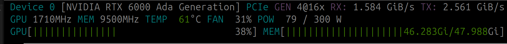

# Local Chat Assistant with Pixtral

This project implements a web-based AI assistant that can answer questions based on text, uploaded PDF documents, or uploaded images. It uses the Pixtral-12B model via vLLM for multimodal understanding and generation, FastAPI for the backend API, and Next.js for the frontend chat interface.

**TTS function currently disabled**
TTS libary is depracated and was excluded in requirements.txt but can be manually donwloaded for testing/debungging.


**Features:**

* **Multimodal Chat:** Engage in text-based chat or ask questions about uploaded PDFs and images.
* **PDF Text Extraction:** Extracts text content from PDF files for context.
* **Image Understanding:** Analyzes uploaded images to answer related questions.
* **Text-to-Speech (TTS):** Optional voice output for AI responses using the `TTS` library.
* **Speech-to-Text (STT):** Optional voice input using the browser's Speech Recognition API. Backend transcription via Whisper is possible but currently optional/commented out.
* **Real-time Interaction:** FastAPI backend with a responsive Next.js frontend.
* **Session Management:** Maintains context (uploaded file) within a session.

## Architecture

The project is divided into two main parts:

1.  **Backend (FastAPI):**
    * Located in the `backend/` directory.
    * Serves the API endpoints for chat, file uploads, and TTS.
    * Handles interaction with the Pixtral model (via vLLM).
    * Performs PDF text extraction, image loading, and TTS synthesis.
    * Manages temporary session data and TTS task status in memory.
    * Serves static files (uploaded images, generated audio).
2.  **Frontend (Next.js):**
    * Located in the `frontend/` directory.
    * Provides the user interface (chatbox).
    * Handles user input (text, voice), file selection, and API calls to the backend.
    * Displays chat history and loading indicators.
    * Plays back TTS audio.

## Setup Options

You can set up the project either manually or using Docker (recommended for easier dependency management and consistency).


### Option 1: Docker Setup (Recommended)

This method uses Docker and Docker Compose to build images and run containers for both the frontend and backend services.

#### Host System Prerequisites

Before you begin, ensure you have the following installed on your machine:

1.  **Docker Engine:** Install Docker Desktop (Windows, macOS) or Docker Engine (Linux). See [Docker documentation](https://docs.docker.com/engine/install/).
2.  **Docker Compose:** Usually included with Docker Desktop. For Linux Docker Engine, you might need to install it separately. See [Docker Compose documentation](https://docs.docker.com/compose/install/).
3.  **NVIDIA GPU Drivers:** Latest drivers for your NVIDIA GPU installed on the host OS.
4.  **NVIDIA Container Toolkit:** Required to allow Docker containers to access the host's GPU. See [NVIDIA Container Toolkit installation guide](https://docs.nvidia.com/datacenter/cloud-native/container-toolkit/latest/install-guide.html). **The backend container will not be able to use the GPU without this.**

#### Configuration

1.  **Backend Environment (`backend/.env`):**
    * Ensure the `backend/.env` file exists (copy `.env.example` if provided).
    * Configure `MODEL_NAME`, `MAX_MODEL_LEN`, `MAX_TOKENS`, `TTS_MODEL`, `ENABLE_GPU_TTS` etc., inside this file. These settings will be used by the backend container.
    * *(Note: `HOST_IP` and `PORT` settings in the `.env` file are ignored for the container itself, as Docker networking handles this, but `HOST_IP` might still be used internally if the code constructs URLs based on it - review `config.py` if needed).*
2.  **Docker Files:** Ensure the following files are present:
    * `Dockerfile` inside the `backend` directory.
    * `Dockerfile` inside the `frontend` directory.
    * `docker-compose.yml` in the project's **root** directory.
    *(These files should have been provided or generated previously).*

#### Build and Run

1.  **Navigate to the project root directory** (the one containing `docker-compose.yml`, `frontend/`, and `backend/`).
2.  **Run Docker Compose:**
    ```bash
    docker compose up --build
    ```
    * `--build`: Forces Docker to rebuild the images using the Dockerfiles (important after code changes).
    * Add `-d` to run in detached mode (background): `docker compose up --build -d`
3.  **First Run:** The first time you run this, Docker will:
    * Build the backend and frontend images (this can take time, especially downloading dependencies and base images).
    * Start the containers.
    * The backend container (vLLM) will likely download the specified LLM (`MODEL_NAME`) upon its first startup if not already cached or mounted via a volume. This can take significant time and requires internet access.
4.  **Stopping:** Press `Ctrl+C` in the terminal where compose is running, or use `docker compose down` if running in detached mode.

#### Accessing the Application

* **Frontend:** Open your browser to `http://localhost:3000`
* **Backend API Docs:** `http://localhost:8000/docs` (The API endpoint used by the frontend is configured internally via Docker networking as `http://backend:8000/api/v1`).

#### Important Docker Notes

* **GPU Requirement:** The `docker-compose.yml` includes settings (`deploy: resources: reservations: devices: ...`) to grant the backend container GPU access. This **requires** the host prerequisites (NVIDIA drivers, NVIDIA Container Toolkit) to be correctly installed and configured. If you don't have a compatible GPU or the toolkit installed, the backend container might fail to start or won't be able to use the GPU.
* **Model Caching:** To avoid re-downloading the large LLM models every time you restart the backend container, consider uncommenting and configuring the volume mounts in the `docker-compose.yml` file (e.g., for `/root/.cache/huggingface` or `/root/.cache/vllm`).
* **Static Files:** Uploaded files and generated TTS audio are stored within the backend container's filesystem by default (`/app/app/static/...`). They will be lost if the container is removed unless you configure a persistent volume mount for `/app/app/static` in the `docker-compose.yml`.


### Option 2: Manual Setup (Backend + Frontend Separately)

#### Prerequisites 

* Python 3.9+
* Node.js 18+ and npm (or yarn/pnpm)
* NVIDIA GPU with appropriate CUDA drivers installed (compatible with vLLM and PyTorch) for the machine running the backend.
* Access to the Pixtral-12B model weights (or another vLLM-compatible model).

#### Backend Setup 

1.  **Navigate to the backend directory:** `cd backend` 
2.  **Create and activate a virtual environment:**
    ```bash
    python -m venv venv
    source venv/bin/activate  # On Windows: venv\Scripts\activate
    ```
    
3.  **Install Python dependencies:** `pip install -r requirements.txt` 
    *(Ensure your environment meets `vllm` GPU/CUDA prerequisites)*
4.  **Configure Environment Variables (`backend/.env`):**
    * Copy `.env.example` to `.env` if it exists, or create `.env`.
    * Edit `.env` and set values like `MODEL_NAME`, `TTS_MODEL`, `MAX_TOKENS`, `ENABLE_GPU_TTS`, etc. Set `HOST_IP` to `127.0.0.1` or your machine's IP if accessing from other devices on your network. `PORT` defaults to 8000.
5.  **Run the backend server:** `python run.py` 
    * The API will be available at `http://<HOST_IP>:<PORT>`.

#### Frontend Setup 

1.  **Navigate to the frontend directory:** `cd frontend` 
2.  **Install Node.js dependencies:** `npm install` 
3.  **Configure Environment Variable (`frontend/.env.development`):**
    * Create `.env.development`.
    * Add the backend API URL, pointing to the running backend:
        ```
        NEXT_PUBLIC_API_URL=http://<BACKEND_HOST_IP>:<BACKEND_PORT>/api/v1
        ```
        (e.g., `NEXT_PUBLIC_API_URL=http://localhost:8000/api/v1`).
4.  **Run the frontend dev server:** `npm run dev` 
    * The frontend will be available at `http://localhost:3000`.

---
**My setup:** 
Pixtral-12B running in float16:



